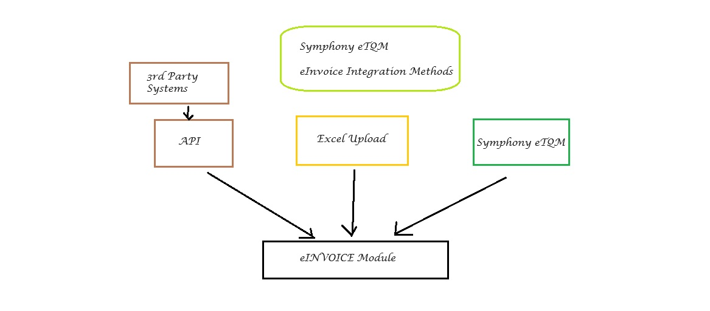

Data Integration
==========

Documents can be entered into Symphony eTQM eInvoice module via 3 main methods:

* **Symphony eTQM Accounting Module**
* **Excel Upload**
* **API**

   Integration with eInvoice module.

