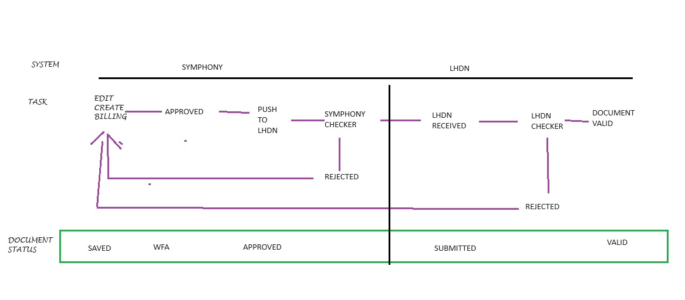

Submit Documents to LHDN
==========

Submitting documents to the tax authority is a crucial task for individuals and businesses to ensure compliance with tax regulations. Proper submission helps avoid penalties, ensures accurate tax calculations, and maintains good standing with the tax authority. This guide will walk you through the process step-by-step.

Type of Documents
--------------------
Documents that need to be submitted to LHDN include the followings :

* **Invoice** -- Invoice is a commercial document issued by Supplier to itemise and record a transaction with Buyer.
* **Credit Note** -- Credit note is the document issued by Suppliers to correct errors, apply discounts, or account for returns in a previously issued e-Invoice with the purpose of reducing the value of the original e-Invoice. This is used in situations where the reduction of the original e-Invoice does not involve return of monies to the Buyer.
* **Debit Note** -- Debit note is the document issued to indicate additional charges on a previously issued e-Invoice.
* **Refund Note** -- Refund note is the document issued by a Supplier to confirm the refund of the Buyer’s payment. This is used in situations where there is a return of monies to the Buyer.
* **Self-Billed Invoice** -- There are certain circumstances where another party (other than the Supplier) will be allowed to issue a self-billed e-Invoice. Self-Billed Invoice refers to the self-billed e-Invoice that will be issued by the Buyer for the transaction with the Supplier, based on the circumstances as specified in Section 8 of the e-Invoice Specific Guideline.
* **Self-Billed Credit Note** -- Self-Billed Credit Note is issued by Buyers to correct errors, apply discounts, or account for returns in a previously issued Self-Billed e-Invoice with the purpose of reducing the value of the original Self-Billed e-Invoice. This is used in situations where the reduction of the original Self-Billed e-Invoice does not involve return of monies to the Buyer
* **Self-Billed Debit Note** -- Self-Billed Debit Note is the document issued by Buyers to indicate additional charges on a previously issued Self-Billed e-Invoice.
* **Self-Billed Refund Note** -- Self-Billed Refund Note is the document issued by Buyers to confirm the refund payment from the Supplier. This is used in situations where there is a return of monies from the Supplier to the Buyer.

Submission Workflow
--------------------------------

The following diagram describes the flow of a Billing Submission between Symphony eTQM and LHDN.
 
Basically, when a user creates a billing it will be checked by the Symphony prior to be sent to the LHDN portal. 

   GitHub template for the tutorial

Creating the Sales Invoice
--------------------------------

#. `Sign in to Symphony <http://symphony.metqm.com:8600/symphony>`_ and navigate to the `tutorial GitHub template <https://github.com/readthedocs/tutorial-template/>`_.

#. Create the Sales Invoice as usual. 

.. note::

   Special attention to :
   1. Ensure the customer details are inorder.
   2. Document Date, must be no more than three days before today and no later than yesterday.

