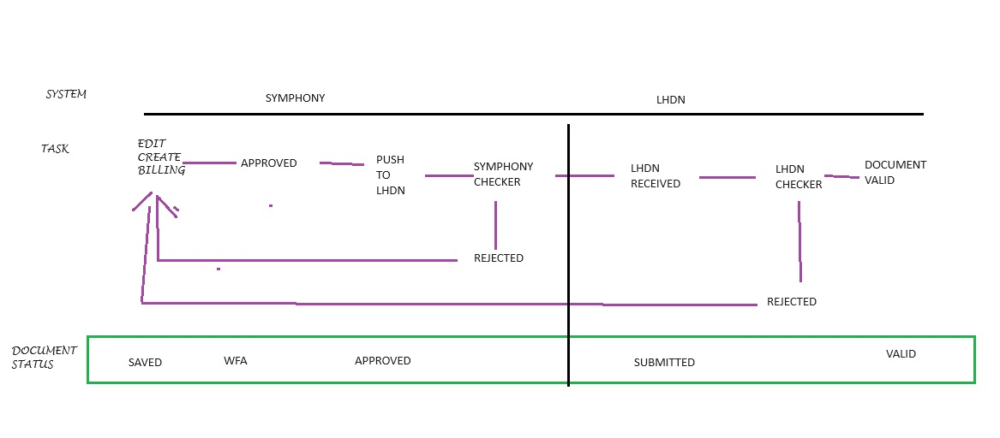

Sales Invoice ( Billing ) Submission to LHDN
==========

Submitting documents to the tax authority is a crucial task for individuals and businesses to ensure compliance with tax regulations. Proper submission helps avoid penalties, ensures accurate tax calculations, and maintains good standing with the tax authority. This guide will walk you through the process step-by-step.

Submission Workflow
--------------------------------

The following diagram describes the flow of a Billing Submission between Symphony eTQM and LHDN.
 
Basically, when a user creates a billing it will be checked by the Symphony prior to be sent to the LHDN portal. 

   GitHub template for the tutorial

Creating the Sales Invoice
--------------------------------

#. Create the Sales Invoice as usual. 

#. `Sign in to Symphony <http://symphony.metqm.com:8600/symphony>`_ and navigate to the `tutorial GitHub template <https://github.com/readthedocs/tutorial-template/>`_.
