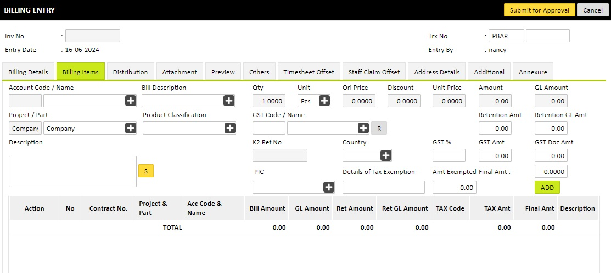
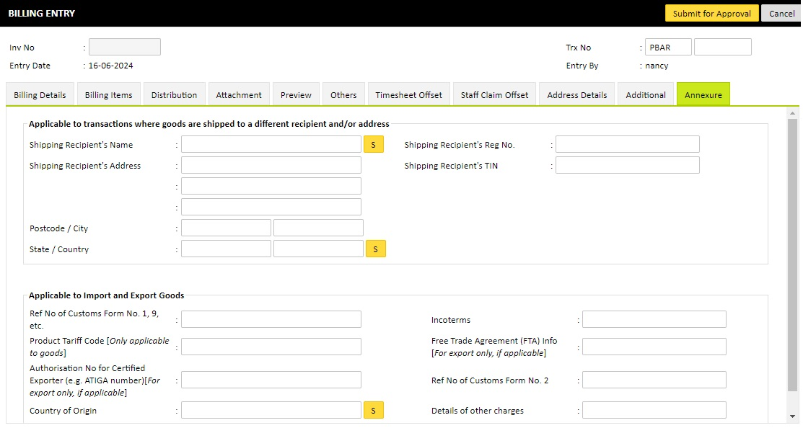

Creating Invoices
=================

Creating an electronic invoice in the eInvoice module is simple and straightforward:

1. **Start a New Invoice:**
   - Go to the eInvoice module and click on "Create New Invoice."

2. **Enter Invoice Details:**
   - Fill in the required fields such as customer information, invoice date, and due date.
   - Add line items for products or services provided, including descriptions, quantities, and prices.

3. **Apply Taxes and Discounts:**
   - Automatically calculate taxes based on your configuration.
   - Apply any discounts if applicable.

4. **Review and Customize:**
   - Review the invoice for accuracy.
   - Customize the invoice template if needed.

5. **Send Invoice:**
   - Click "Send" to transmit the invoice electronically to the customer.

The eInvoice module ensures that your invoices are compliant with electronic invoicing standards and are delivered securely.

   Workflow with integration with LHDN API eInvoice portal.

.. note::

   Take note of the additional field **Product Classification**,
   which is mapped to LHDN code.

For foreign company, fill in the Annexture.

