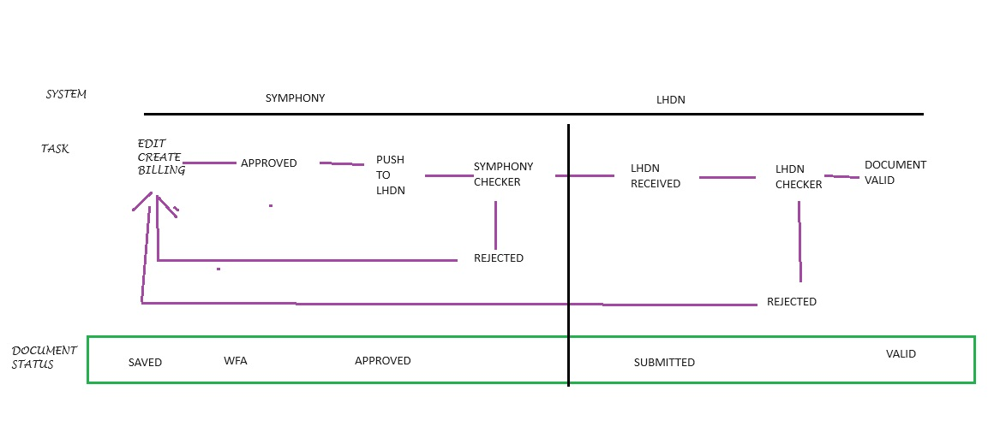

Sales Invoice ( Billing ) Submission to LHDN
==========

Submitting documents to the tax authority is a crucial task for individuals and businesses to ensure compliance with tax regulations. Proper submission helps avoid penalties, ensures accurate tax calculations, and maintains good standing with the tax authority. This guide will walk you through the process step-by-step.

Submission Workflow
--------------------------------

The following diagram describes the flow of a Billing Submission between Symphony eTQM and LHDN.
 
Basically, when a user creates a billing it will be checked by the Symphony prior to be sent to the LHDN portal. 

   GitHub template for the tutorial

Creating the Sales Invoice
--------------------------------

Creating an electronic invoice in the eInvoice module is simple and straightforward:

#. `Sign in to Symphony <http://symphony.metqm.com:8600/symphony>`_ and navigate to the `tutorial GitHub template <https://github.com/readthedocs/tutorial-template/>`_.

#. Create the Sales Invoice as usual. 

.. note::

   Special attention to :
   1. Ensure the customer details are inorder.
   2. Document Date, must be no more than three days before today and no later than yesterday.

1. **Start a New Invoice:**
   - Go to the eInvoice module and click on "Create New Invoice."

2. **Enter Invoice Details:**
   - Fill in the required fields such as customer information, invoice date, and due date.
   - Add line items for products or services provided, including descriptions, quantities, and prices.

3. **Apply Taxes and Discounts:**
   - Automatically calculate taxes based on your configuration.
   - Apply any discounts if applicable.

4. **Review and Customize:**
   - Review the invoice for accuracy.
   - Customize the invoice template if needed.

5. **Send Invoice:**
   - Click "Send" to transmit the invoice electronically to the customer.

The eInvoice module ensures that your invoices are compliant with electronic invoicing standards and are delivered securely.

   Workflow with integration with LHDN API eInvoice portal.

.. note::

   Take note of the additional field **Product Classification**,
   which is mapped to LHDN code.

.. figure:: images/billing_annexure.jpg
   :alt: Work Flow eInvoice
   :align: center
   :scale: 75%

   For foreign company, fill in the Annexture.
