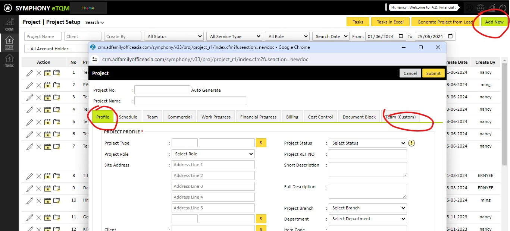

=====================
Creating a New Project
=====================

Follow the steps below to create a new project in the Project Module.

1. Click on the Project Management in the Project Module
---------------------------------------------------------
First, navigate to the Project Module within the system interface. Locate and click on the **Project Management** section.

2. Click on the "Create New" button
-----------------------------------
In the Project Management section, find and click on the **"Create New"** button to initiate the creation of a new project.

3. Fill in the project details in the popup page
------------------------------------------------
A popup page will appear, prompting you to fill in the project details. This form includes various fields that need to be completed to define the project.

4. Enter the mandatory fields
-----------------------------
Ensure that all mandatory fields marked in red are entered. These fields are essential for the successful creation of the project.

5. Complete the project information
-----------------------------------
Make sure to provide the following key details:
   - **Project Code:** Enter a unique identifier for the project.
   - **Project Name:** Provide a descriptive name for the project.
   - **Project Status:** Select the current status of the project from the available options.

Once all required information is entered, you can proceed to save or submit the project details as per your system's workflow.

