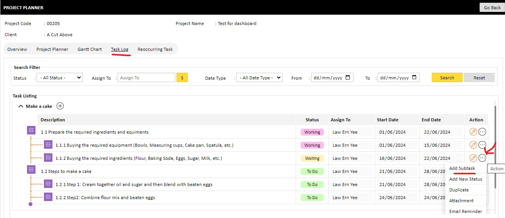

=============================
User Guide for Creating Tasks
=============================

Creating Tasks
--------------
You cannot create tasks directly. Tasks are created based on the Project Type Template selected. If there are missing tasks that need to be added, you will need to talk to your system administrator. However, you can add sub-tasks to existing tasks.

Adding Sub-Tasks
----------------
To add a sub-task, follow these steps:

1. Navigate to the "Task Log" Tab
---------------------------------
Go to the **Task Log** Tab where all tasks are listed.

2. Click on "Add SubTask" against the Action Button on the selected Task
------------------------------------------------------------------------
Locate the task you want to add a sub-task to. Click on the **"Add SubTask"** button found next to the Action Button of the selected task.

By following these steps, you can efficiently add sub-tasks to manage your project workflow more effectively.
