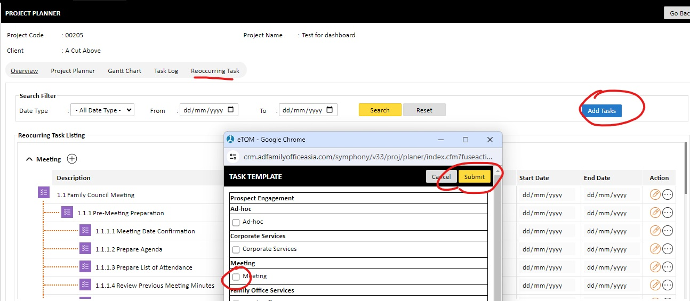

=============================
User Guide for Creating Recurring Tasks
=============================

Creating Recurring Tasks
-------------------------
Follow these steps to create recurring tasks in the Project Module:

1. Click on the "Recurring Task" Tab
------------------------------------
Navigate to the **Recurring Task** tab located under the Planner Module within the Project Module.

2. Click on the "Add Task" Button
---------------------------------
Click on the **"Add Task"** button to initiate the process of adding a new recurring task.

3. A Pop-Up with a List of Standard Activities Will Appear
----------------------------------------------------------
A pop-up window will appear displaying a list of standard activities as shown in the picture below:

4. Choose the Activity You Wish to Add
--------------------------------------
From the list of standard activities, select the activity you wish to add to the recurring tasks.

5. Press the "Add" Button
-------------------------
Once you have selected the desired activity, press the **Add** button.

6. List of Tasks Related to the Activity Will Be Populated
----------------------------------------------------------
The list of tasks related to the selected activity will be populated.

7. Update the Start Date and End Date for Each Task
---------------------------------------------------
For each task in the list, update the **Start Date** and **End Date** as required.

By following these steps, you can efficiently create and manage recurring tasks within your project.
